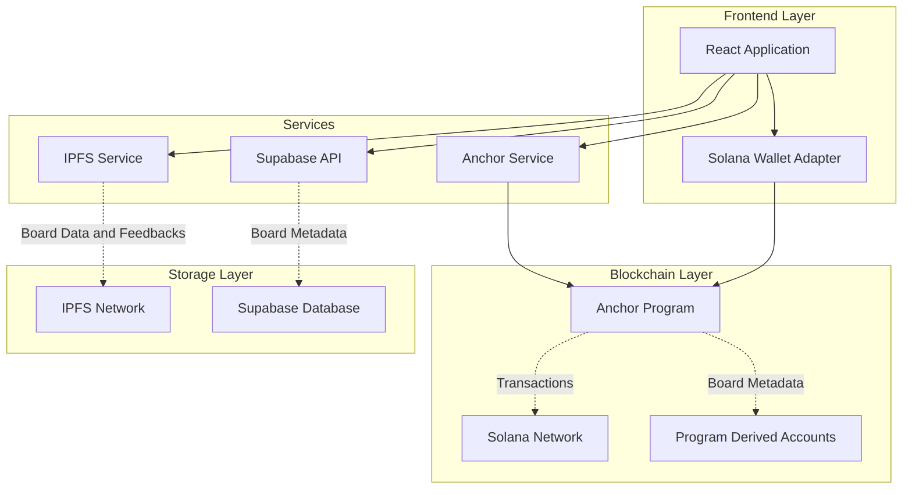
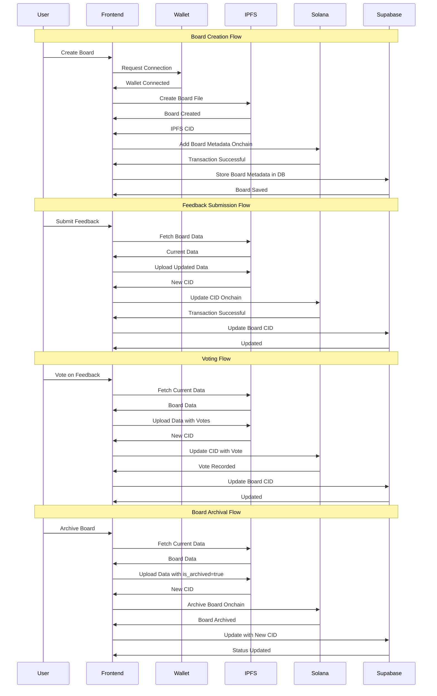

# 🚀 Feedana - Anonymous Feedback Platform

<div align="center">


[](https://reactjs.org/)
[](https://solana.com/)
[](https://supabase.com/)
[](https://ipfs.io/)
[](https://tailwindcss.com/)


**Anonymous feedback collection without the politics - no registration, no retaliation**

[🌐 Live Demo](https://feedana.top) | [📚 Documentation](#🎨-architecture) | [🤝 Contributing](#🤝-contributing)

</div>

---

## 📖 Table of Contents

- [🌟 Overview](#🌟-overview)
- [✨ Key Features](#✨-key-features)
- [🏗️ Architecture](#🎨-architecture)
- [🛠️ Tech Stack](#🛠️-tech-stack)
- [🤝 Contributing](#🤝-contributing)
- [📄 License](#📄-license)

---

## 🌟 Overview

**Feedana** is a decentralized feedback platform that empowers users to collect valuable feedback effortlessly. Built on the Solana blockchain with IPFS for distributed storage, it ensures complete anonymity and censorship resistance while maintaining data integrity.

### 🎯 Mission

Create a feedback ecosystem where honest opinions can be shared without fear of retaliation, enabling organizations and individuals to receive authentic insights for continuous improvement.

---

## ✨ Key Features

### 🔒 **Complete Anonymity**
- No user registration required
- Anonymous feedback submissions
- Privacy-first design philosophy
- Zero personal data collection

### ⚡ **Lightning Fast**
- Built on Solana for sub-second transactions
- Real-time feedback updates
- Instant board creation and sharing
- Live feedback counter system

### 🌍 **Decentralized & Censorship-Resistant**
- IPFS for distributed data storage
- Blockchain-based board ownership
- No single point of failure
- Immutable feedback records

### 🗳️ **Voting System**
- Upvote/downvote feedback submissions
- Simple feedback ranking
- User-driven content rating
- Vote tracking on blockchain

### 📁 **Board Management**
- Archive boards when feedback collection is complete
- Prevent new submissions to archived boards
- Maintain historical feedback data
- Creator-controlled board lifecycle

### 🎨 **Beautiful & Intuitive**
- Modern, responsive design
- Interactive animations with GSAP
- Glass morphism UI elements
- Mobile-first approach

---

## 🏗️ Architecture

### System Overview



### Data Flow Architecture



Feedana follows a decentralized architecture with three core layers:

### Frontend Layer
- **React Application** - Modern React 18 with hooks and component-based architecture
- **Wallet Integration** - Solana wallet adapter for seamless Web3 connectivity
- **State Management** - Redux Toolkit for global application state

### Blockchain Layer
- **Solana Network** - High-performance blockchain for board ownership and transactions
- **Anchor Program** - Smart contract framework for program logic
- **Program Derived Addresses (PDAs)** - Deterministic accounts for board management

#### Program Instructions
The smart contract implements 5 core instructions with comprehensive validation and fee collection:

- **`create_feedback_board`** - Initialize new feedback boards with metadata and IPFS integration (Platform fee: 10 lamports)
- **`submit_feedback`** - Process anonymous feedback submissions and update IPFS storage (Platform fee: 1 lamport)
- **`upvote_feedback`** - Users can upvote feedback with IPFS updates (Platform fee: 1 lamport)
- **`downvote_feedback`** - Users can downvote feedback with IPFS updates (Platform fee: 1 lamport)  
- **`archive_feedback_board`** - Creator-only board archival to prevent new interactions while preserving data (No fee)

#### Validation & Security Features
- **Archive Protection**: Prevents voting and feedback submission on archived boards
- **Creator Authorization**: Only board creators can archive their boards
- **IPFS Validation**: Comprehensive CID format and length validation (32-64 chars, must start with "Qm" or "b")
- **Platform Fee Collection**: Automatic fee transfer to platform wallet `96fN4Eegj84PaUcyEJrxUztDjo7Q7MySJzV2skLfgchY`
- **Event Emission**: All actions emit blockchain events for tracking and analytics

#### Account Structure
```rust
pub struct FeedbackBoard {
    pub creator: Pubkey,     // Board creator's wallet address (32 bytes)
    pub ipfs_cid: String,    // Current IPFS content identifier (4 + up to 64 bytes)
    pub board_id: String,    // Unique board identifier (4 + up to 28 bytes)
    pub is_archived: bool,   // Archive status flag (1 byte)
}
```

#### Error Handling
The program implements 15 comprehensive error types:
- **`InvalidIpfsCid`** - Invalid IPFS CID format validation
- **`BoardIdTooLong`** - Board ID exceeds maximum length
- **`EmptyBoardId`** / **`EmptyIpfsCid`** - Empty field validation
- **`DuplicateFeedbackBoard`** - Prevents duplicate board creation
- **`InsufficientFunds`** - Validates sufficient SOL balance
- **`CreatorCannotSubmit`** - Prevents creators from self-feedback
- **`BoardAlreadyArchived`** - Duplicate archival prevention
- **`CannotSubmitToArchivedBoard`** - Archive interaction protection
- **`CannotUpvoteInArchivedBoard`** / **`CannotDownvoteInArchivedBoard`** - Archive voting protection
- **`UnauthorizedAccess`** - Creator-only action enforcement

#### Events System
- **`FeedbackBoardCreated`** - Board initialization tracking
- **`FeedbackSubmitted`** - Feedback submission logging
- **`FeedbackUpvoted`** / **`FeedbackDownvoted`** - Vote tracking with voter identity
- **`FeedbackBoardArchived`** - Board lifecycle management

### Storage Layer
- **IPFS Network** - Distributed storage for feedback data and board content
- **Pinata Service** - Reliable IPFS pinning for data availability
- **Supabase Database** - Real-time database for metadata and board indexing

### Service Integration
The application integrates these layers through dedicated service modules:
- `supabaseApi.js` - Database operations and board management
- `ipfsService.js` - IPFS operations for distributed storage
- `anchorService.js` - Solana blockchain interactions

---

## 🛠️ Tech Stack

### Frontend
- **React 18.2.0** - Modern React with hooks and concurrent features
- **Vite** - Lightning-fast build tool and dev server
- **TailwindCSS** - Utility-first CSS framework
- **Framer Motion** - Smooth animations and transitions
- **GSAP** - Professional-grade animations
- **React Router** - Client-side routing
- **React Hook Form** - Performant forms with easy validation

### Blockchain & Web3
- **Solana Web3.js** - Solana blockchain interaction
- **Anchor Framework** - Solana program development
- **Wallet Adapter** - Universal wallet connection
- **@coral-xyz/anchor** - TypeScript client for Anchor programs

### Storage & Backend
- **Supabase** - PostgreSQL database with real-time subscriptions
- **IPFS** - Distributed file storage

---

## 🤝 Contributing

We welcome contributions from the community! Here's how you can help:

### Getting Started
1. Fork the repository
2. Create a feature branch
3. Make your changes
4. Submit a pull request

### Contribution Guidelines
- Follow existing code style
- Add tests for new features
- Update documentation
- Ensure responsive design

### Areas for Contribution
- 🐛 Bug fixes and improvements
- ✨ New features and enhancements
- 📚 Documentation improvements
- 🎨 UI/UX enhancements
- 🔧 Performance optimizations

---

## 📄 License

This project is licensed under the MIT License. See the [LICENSE](LICENSE) file for details.

---

<div align="center">

**Built with ❤️ for the future of anonymous feedback**

[⭐ Star this repo](https://github.com/0xsouravm/feedana-ui) | [🐛 Report Bug](https://github.com/0xsouravm/feedana-ui/issues) | [💡 Request Feature](https://github.com/0xsouravm/feedana/issues)

</div>
